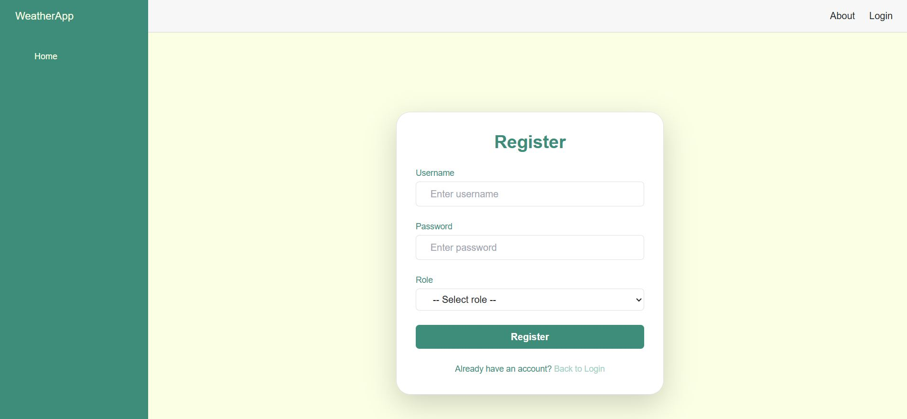
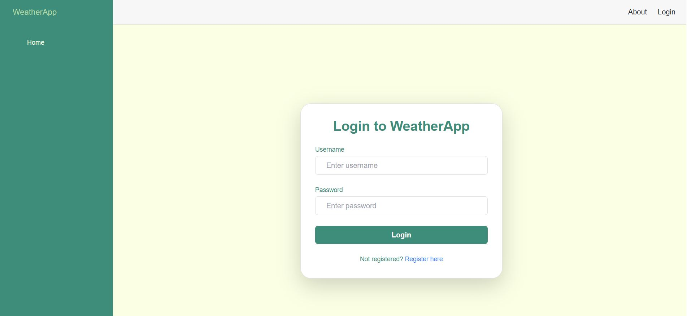
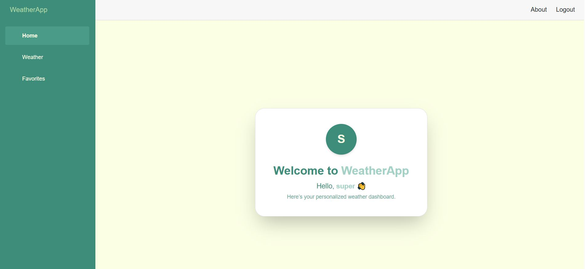
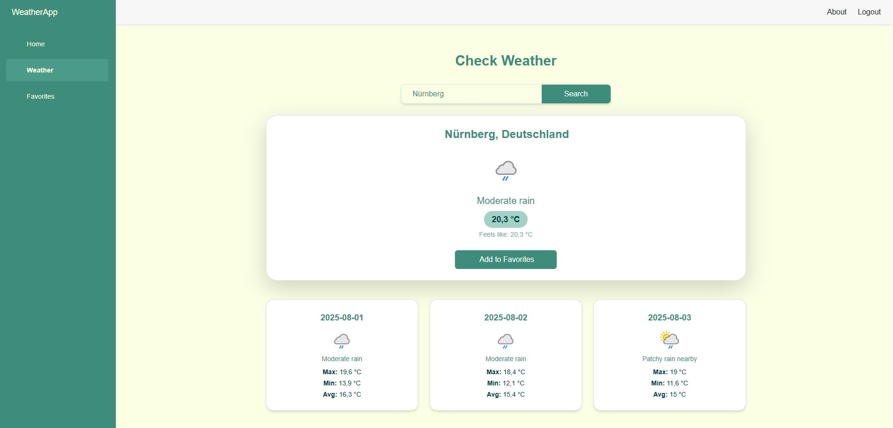
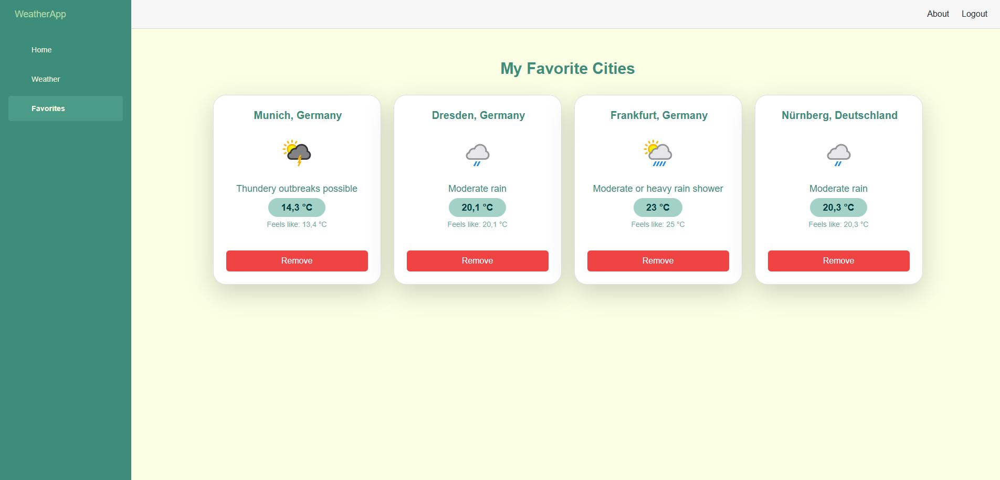
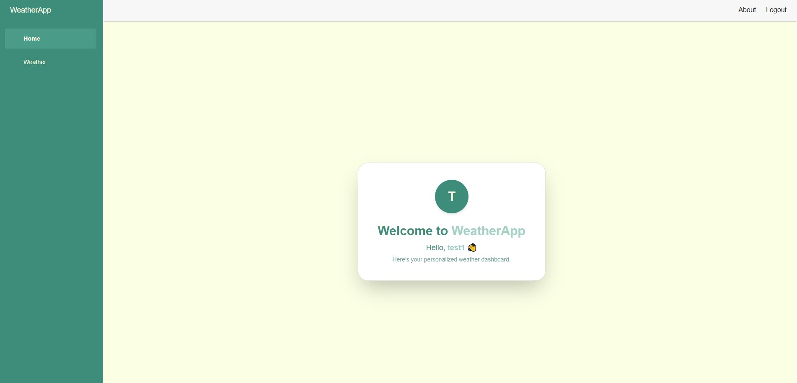
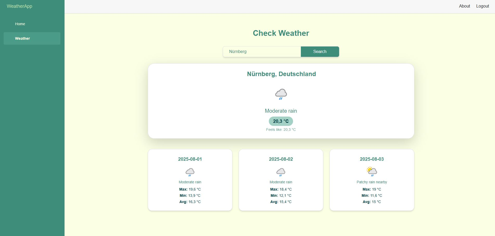

# WeatherApp

A responsive, role-based weather dashboard built with **Blazor Wep App** using a custom theme and Tailwind CSS. Users can search for weather by city, and `super` users can save favorite cities.

---

## Tech Stack

### Frontend
- **Blazor Server (.NET 8)**
- **Tailwind CSS** for custom UI

### Backend
- **ASP.NET Core 8**
- **Entity Framework Core (MySQL)**
- **BCrypt.Net** for secure password hashing
- **ASP.NET Core Cookie Authentication**

---

## Setup Instructions

### Prerequisites

- [.NET 8 SDK](https://dotnet.microsoft.com/download)
- [MySQL Server](https://dev.mysql.com/downloads/mysql/)
- [Visual Studio 2022+](https://visualstudio.microsoft.com/) or VS Code

---

### 1. Clone the Repository

```bash
git clone https://github.com/vidishashah25/WeatherApp.git
cd WeatherApp

---

## Screenshots

### Registration Page



### Login Page



### Login as Super user role

### Dashboard Page 



### Weather Page 



### FavoriteCities Page 



### Login as Simple user role

### Dashboard Page 



### Weather Page 




